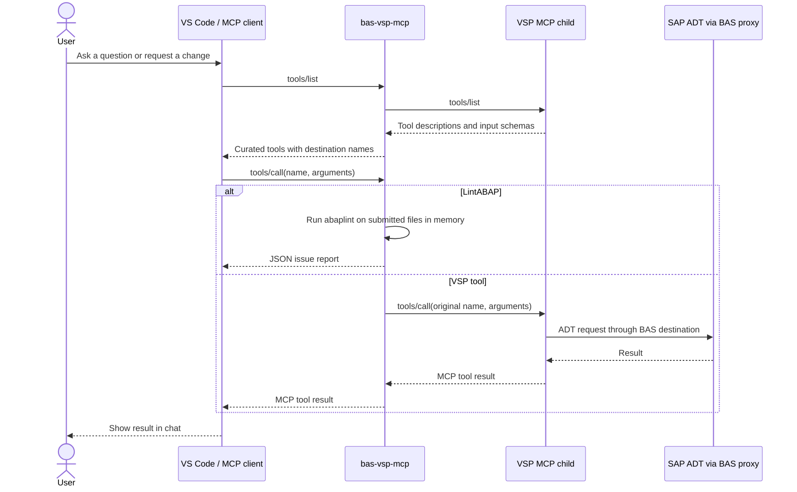

# 🧭 BAS MCP Addon

<p align="center">
  <strong>End-to-end ABAP development from GitHub Copilot Chat in SAP Business Application Studio.</strong><br>
  A destination-aware MCP bridge between BAS, SAP ADT, and your AI coding agent.
</p>

<p align="center">
  <a href="https://www.npmjs.com/package/bas-mcp-addon"></a>
  
  <a href="LICENSE"></a>
  
</p>

`bas-mcp-addon` installs `bas-vsp-mcp`, which discovers BAS destinations and exposes a curated VSP tool set over the Model Context Protocol (MCP).

## 🚀 Fully automated ABAP development

Describe a task in Copilot Chat; the **ABAP Developer** agent coordinates the live MCP tools to inspect SAP objects and dependencies, implement the requested change, run relevant checks, and report what actually happened. No hand-written MCP calls or terminal commands for each SAP operation.

**💬 Request → 🔎 Inspect → 🧑‍💻 Implement → 🧪 Verify → 📋 Report**

The workflow covers ABAP, CDS, RAP, debugging, quality checks, and transport preparation. Tool availability depends on the connected SAP system and VSP mode; the agent checks the live tool list and reports checks it could not run.

> 🔐 **SAP changes stay controlled.** The agent only performs state-changing work when requested and the destination and required target details are known. Activation, service publication, and transport creation require explicit authorization. SAP permissions still apply; transport release and deletion are not exposed by this add-on.

**✨ At a glance:** BAS destination routing · Copilot agent + six focused skills · ABAP Unit, lint, syntax, and ATC workflows · destination-isolated MCP servers

**Quick links:** [Install](#install) · [ABAP agent & skills](#copilot-agent) · [BAS setup](#bas) · [Tool catalog](#tools) · [Troubleshooting](#troubleshooting)

Bring Node.js 20 or newer. If Go isn't already available, the installer takes care of it.

<a id="install"></a>

## 📦 Installation

Install globally from a BAS dev space:

```sh
npm install --global bas-mcp-addon
```

The installer handles two bits of setup automatically:

1. Looks for Go in `GO_BINARY`, `PATH`, or the package-local Go installation. If none turns up, it downloads and installs the pinned supported Go release without prompting.
2. Uses the package's checksum-verified patched VSP binary for the current platform. A remote download is the fallback only when the package has no bundled asset.

With `H2O_URL` set and named destinations available, an interactive install opens a checkbox picker with no destinations selected by default. Use Space to choose destinations and Enter to confirm. Press `a` to toggle all destinations (select all if any are unchecked; otherwise clear the selection). Confirming with none selected removes this add-on's managed MCP entries. npm may run its install hook without an interactive terminal, even when the shell is interactive; in that case selection is skipped without changing MCP config.

The colored status table is a weather report, not a bouncer: green means the ADT probe responded, red means it failed, and yellow means it was skipped. Probe failures don't block MCP registration or startup for destinations you select.

Run `bas-vsp-mcp --setup` later to change the selection or remove generated entries. Use `--npx` to make the generated entries start the pinned package through npm instead of relying on a global `bas-vsp-mcp` command.

If a setup step is skipped or fails, rerun it from an interactive BAS terminal:

```sh
bas-vsp-mcp --setup
```

To configure without a global install, run the guided setup directly through npm:

```sh
npx --yes --ignore-scripts --package=bas-mcp-addon bas-vsp-mcp --setup --npx
```

This lists discovered systems in the same checkbox picker, with nothing selected by default. Use Space to choose destinations, Enter to confirm, and `a` to toggle all (select all if any are unchecked; otherwise clear the selection). It writes MCP entries that launch the selected servers through `npx`. The entries pin the package version used during setup, and `--ignore-scripts` avoids running the install-time wizard a second time. After setup, in BAS/VS Code run **MCP: List Servers**, select each chosen destination, and choose **Start Server**.

For a non-interactive installation or a platform without a published VSP asset, provide a trusted binary override:

```sh
BAS_VSP_BINARY=/path/to/vsp npm install --global bas-mcp-addon
```

Once setup is complete, the installer prints each generated MCP server name beside its BAS destination, then shows how to connect. In BAS/VS Code:

1. Open the Command Palette.
2. Run **MCP: List Servers**.
3. Select the printed server named for the BAS destination and choose **Start Server**.

Use **MCP: Open User Configuration** to inspect or edit the generated entries. Each entry is isolated to its displayed `BAS_VSP_DESTINATION`.

<a id="copilot-agent"></a>

## 🤖 GitHub Copilot ABAP agent and skills

The package includes a user-invocable [**ABAP Developer**](.github/agents/abap-developer.agent.md) custom agent and six task-focused Agent Skills for VS Code Copilot ([custom agents](https://code.visualstudio.com/docs/agent-customization/custom-agents), [Agent Skills](https://code.visualstudio.com/docs/agent-customization/agent-skills)).

### 🧠 How the agent works

1. **Understand the request.** Establish the expected behavior and, for SAP changes, the destination, package, and transport or temporary target. Ask only when a material detail is missing.
2. **Inspect before editing.** Read relevant source, tests, callers, dependencies, and conventions; query the active MCP server's live `tools/list` and use its exact destination-prefixed tools and schemas.
3. **Implement with behavior in mind.** Add or refine an ABAP Unit assertion first when an executable regression test is available, then make the smallest change that meets the request.
4. **Verify with available checks.** Use `LintABAP` for caller-supplied source, BAS editor LSP diagnostics when configured, and SAP `SyntaxCheck`, `RunUnitTests`, and `RunATCCheck` when exposed and relevant. Lint and syntax checks do not replace behavior tests.
5. **Protect SAP state.** Only make requested changes. Activate objects or publish services only when asked; create transports only when explicitly authorized. Release and deletion of transports are unavailable through this add-on.
6. **Report observed results.** Summarize changed objects and actual validation, activation, or publication outcomes. Identify skipped checks and exact blockers; never claim a check passed if it did not run.

### 🧩 Included Agent Skills

| Skill | Focus |
| --- | --- |
| [`abap-development`](.github/skills/abap-development/SKILL.md) | Implement and refactor ABAP reports, classes, interfaces, and function groups. |
| [`abap-testing-quality`](.github/skills/abap-testing-quality/SKILL.md) | ABAP Unit behavior tests, lint, LSP diagnostics, syntax checks, and ATC. |
| [`cds-development`](.github/skills/cds-development/SKILL.md) | Model CDS definitions and inspect dependencies and consumers. |
| [`rap-development`](.github/skills/rap-development/SKILL.md) | Build RAP business objects and services; publish only when requested. |
| [`abap-debugging`](.github/skills/abap-debugging/SKILL.md) | Diagnose dumps, application logs, traces, and runtime failures. |
| [`sap-transport-release`](.github/skills/sap-transport-release/SKILL.md) | Check dependencies and prepare changes for transport; release is not available here. |

### 📥 Install for your BAS user

After destination setup, an interactive global install offers to install the agent and all six skills under `$HOME/.copilot`. The prompt defaults to yes: press Enter to install or `n` then Enter to decline. Declining leaves those files unchanged.

These user-level customizations are available across workspaces opened by the same BAS user in the same dev space. Copilot must be available in BAS and may need a window reload to discover new files. A non-interactive install skips the optional prompt; `npm install --ignore-scripts` skips the postinstall wizard entirely.

On reinstall or package upgrade, unchanged add-on-managed files are updated. Existing customizations and files edited since the previous install are preserved; postinstall reports paths that need manual review instead of overwriting them.

### 🗂️ Add the agent and skills to a repository

To commit repository-scoped customizations, copy the packaged files from the BAS workspace root without overwriting existing files:

```sh
ADDON_ROOT="$(npm root -g)/bas-mcp-addon"
mkdir -p .github/agents .github/skills
cp -n "$ADDON_ROOT/.github/agents/abap-developer.agent.md" .github/agents/
cp -Rn "$ADDON_ROOT/.github/skills/." .github/skills/
```

Review skipped or conflicting files and merge changes manually. `LintABAP` analyzes caller-supplied source in memory; it does not read workspace files. `vsp lsp --stdio` supplies editor diagnostics separately and does not appear in MCP `tools/list`.

<a id="bas"></a>

## 🧭 BAS setup

`bas-vsp-mcp --setup` reads destination names from `H2O_URL/api/listDestinations`, then gives each destination's `/sap/bc/adt/discovery` endpoint a quick knock through the BAS proxy. HTTP 2xx, 401, and 403 count as reachable; other responses and network failures are reported but do not exclude discovered destinations from the selection list or prevent startup when selected.

Interactive npm install and `bas-vsp-mcp --setup` both use a checkbox picker with no destinations selected by default. Use Space to choose destinations, Enter to confirm, and `a` to toggle all (select all if any are unchecked; otherwise clear the selection). Confirming with none checked removes this package's generated MCP entries. Non-interactive installs skip destination selection without changing MCP config. Run the interactive setup command above; add `--npx` when the package is not installed globally.

Setup tidies its own footprint: it reconciles MCP entries managed by this package and removes its legacy `basVspMcp_*` entries. Existing unrelated MCP servers and top-level configuration such as `inputs` stay untouched.

### 🌐 BAS destination example

First, give BAS a route to your backend: create the destination in **BTP Cockpit → Connectivity → Destinations** in the subaccount where BAS runs.
The sample values sketch an on-premise ABAP backend routed through SAP Cloud Connector; swap in the URL, proxy type, and authentication configured for your landscape.

| Destination field | Example | Notes |
| --- | --- | --- |
| Name | `DEMO_ABAP` | Unique BAS destination name. It becomes both `BAS_VSP_DESTINATION` and the generated MCP server name. |
| Type | `HTTP` | ADT is an HTTP service. |
| URL | `https://abap.example.com:44300` | Backend URL exposed through the configured route. |
| Proxy Type | `OnPremise` | Use `OnPremise` for Cloud Connector; use `Internet` for a directly reachable public endpoint. |
| Authentication | `PrincipalPropagation` | Example only; choose an authentication method configured for the backend and Cloud Connector. |
| `sap-client` | `100` | SAP client to target. The add-on defaults to `001` if omitted. |
| `HTML5.DynamicDestination` | `true` | BAS destination property shown in the supplied sample. |
| `WebIDEEnabled` | `true` | Exposes the destination to BAS development tools. |
| `WebIDEUsage` | `dev_abap,odata_abap` | Include `dev_abap` for ABAP development; add other usages required by your BAS scenario. |
| `CloudConnectorLocationId` | `DEMO-LOCATION` | Optional; set only when the Cloud Connector uses a location ID. |

For on-premise systems, configure Cloud Connector access to the backend host and port first. Keep credentials and authentication material in the BAS destination configuration; never put them in `mcp.json`.

Think of `H2O_URL` as BAS's front door: it must point to the endpoint serving `/api/listDestinations`, not to the SAP backend.

The `/api/listDestinations` response is a JSON array of destination records, like the provided `dests.sample.json`. A representative record:

```json
{
  "Type": "HTTP",
  "HTML5.DynamicDestination": "true",
  "Authentication": "PrincipalPropagation",
  "WebIDEEnabled": "true",
  "ProxyType": "OnPremise",
  "sap-client": "100",
  "Name": "DEMO_ABAP",
  "WebIDEUsage": "dev_abap,odata_abap",
  "Host": "https://abap.example.com:44300",
  "WebIDEExposedHost": "abap.example.com:44300"
}
```

The BAS editor calls the backend address `URL`; the sample-style list response may report it as `Host`. Discovery needs a non-empty `Name`, reads `Authentication` and `sap-client` case-insensitively, and accepts these fields either at the record root or under `Properties`.

A destination name must start with a letter or digit and contain only letters, digits, `.`, `_`, or `-`.

The add-on probes `http://<Name>.dest/sap/bc/adt/discovery` through the BAS proxy. HTTP 2xx, 401, and 403 mean the ADT endpoint is reachable; other responses and network errors are reported but do not exclude a discovered destination from the selection list.

`WebIDEEnabled`, `WebIDEUsage`, `HTML5.DynamicDestination`, and returned host fields are BAS metadata, not filters used by this probe.

See [SAP Help: Create a Destination to Connect to SAP Business Application Studio](https://help.sap.com/docs/PRODUCT_ID/e0cd7c1ecf3d4f2f9feb46ec1c5b68fb/0af2819bbe064a3da455753c8518dd81.html) and
[Creating a Destination to an ABAP System for BAS](https://help.sap.com/docs/btp/sap-business-technology-platform/creating-destination-to-abap-system-for-sap-business-application-studio).

### 🔌 Generated MCP server entry

One selected system, one isolated stdio MCP entry. Here's the shape:

```json
{
  "type": "stdio",
  "command": "bas-vsp-mcp",
  "env": {
    "H2O_URL": "https://bas.example.com",
    "BAS_VSP_DESTINATION": "DEMO_ABAP",
    "SAP_ALLOW_TRANSPORTABLE_EDITS": "true"
  },
  "BAS_EXT": "true"
}
```

Credentials, cookies, SAP usernames, passwords, and raw BAS destination payloads are not written to the MCP configuration.

## ⚙️ MCP configuration location

The configuration path is selected in this order:

1. `BAS_VSP_MCP_CONFIG`
2. Existing `$HOME/.vscode/data/User/mcp.json`
3. Existing `$HOME/.vscode-server/data/User/mcp.json`
4. Existing `$HOME/.code-server/data/User/mcp.json`
5. `$HOME/.vscode/data/User/mcp.json` as the default

Set `BAS_VSP_MCP_CONFIG` when the BAS deployment uses a different user-data location:

```sh
BAS_VSP_MCP_CONFIG="$HOME/.vscode/data/User/mcp.json" bas-vsp-mcp --setup
```

The file must be strict JSON with an object-valued `servers` property. Existing malformed or incompatible files are rejected without overwriting them.

## 🛠️ Commands

Need the options without starting the MCP server?

```sh
bas-vsp-mcp --help
```

Walk through the setup interactively:

```sh
bas-vsp-mcp --setup
```

See the discovered systems and how their probes fared:

```sh
bas-vsp-mcp --list-destinations
```

Need the same report in machine-readable, redacted form?

```sh
bas-vsp-mcp --list-destinations --json
```

Just checking availability, without starting the server?

```sh
bas-vsp-mcp --check
```

With `H2O_URL` set, the normal command starts the MCP proxy. Each generated entry supplies one `BAS_VSP_DESTINATION`, so each server stays in its own lane and exposes only its selected BAS system.
The proxy exposes its curated baseline plus the VSP tools listed in [tools.md](tools.md) when the installed VSP mode registers them. It enables `CreateTransport` and transportable source edits in generated MCP entries; transport release and deletion remain unavailable. Direct VSP invocation remains unchanged.

Without `H2O_URL`, the command passes arguments directly to the installed VSP binary—no BAS proxy detour.

## 🔄 How an MCP tool call reaches SAP

`bas-vsp-mcp` is an MCP **stdio server and destination router**, not a terminal command for individual SAP operations. No shell incantations needed: your MCP client discovers the tools, picks one for the chat request, and sends the call over stdio.



Each generated MCP server entry uses its BAS destination name verbatim: `DEMO_ABAP` stays `DEMO_ABAP`. Tool names use the normalized destination slug instead, so the prefix is `demo-abap` (`demo-abap__GetSource`, `demo-abap__RunQuery`, `demo-abap__LintABAP`). Use the exact names shown by your MCP client; punctuation can change during slugification.

The proxy keeps VSP tool descriptions and input schemas, then adds the destination label. `LintABAP` is the exception: it is implemented locally and uses the shared input schema shown by `tools/list`. It lints only submitted source in memory; it does not read the workspace, call SAP, or load configured external dependencies. Supply every dependency source file in `files`. The live `tools/list` result remains the source of truth for the installed VSP binary's exact schemas.

<a id="tools"></a>

## 🧰 Tool catalog

The menu includes the existing curated VSP tools, additions listed in [tools.md](tools.md) when registered by the active VSP mode, the `GetApplicationLog` mapping, and local `LintABAP`. Focused mode may omit `ActivateMultiple`, `GetUserTransports`, and `GetTransportInfo`; the live `tools/list` result remains authoritative.

### 🧹 Lint submitted ABAP source locally

The per-destination tool name is `<destination-slug>__LintABAP`, for example `demo-abap__LintABAP`. It accepts caller-supplied abapGit-serialized source files; `config` is optional and, when present, is the full abaplint configuration rather than a merge with defaults.

```json
{
  "files": [
    {
      "filename": "zdemo.prog.abap",
      "source": "REPORT zdemo.\nWRITE 'Hello'."
    }
  ]
}
```

`files` must be a nonempty array of `{ "filename": string, "source": string }` entries. The basename follows `<object>.<type>.<extension>`, such as `zcl_demo.clas.abap`. If the code depends on other objects, include those sources in the same `files` array; the tool does not resolve `config.dependencies`, read local files, make network requests, or contact SAP.

The single text item in the MCP result contains JSON: `{ "status": "clean" | "issues", "filesChecked": number, "issueCount": number, "errors": number, "warnings": number, "infos": number, "issues": [...] }`. Each issue reports `filename`, `rule`, `severity`, `message`, and `start`/`end` positions with `line` and `column`. Lint findings—including Error-severity findings—are reports, not MCP tool-call errors.

### 🔎 Find and understand ABAP objects

| Tool | What it does |
| --- | --- |
| `GetSource` | Read source for programs, classes, interfaces, function modules/groups, includes, CDS, and supported RAP/DDIC objects. |
| `SearchObject` | Find repository objects by name or wildcard query. |
| `GrepObjects` | Search regular expressions across specified object URLs. |
| `GrepPackages` | Search regular expressions in one or more packages, optionally including subpackages. |
| `FindDefinition` | Locate a symbol's definition from source text and a position. |
| `FindReferences` | Find references to an object or a symbol. |
| `GetContext` | Summarize public signatures of source dependencies for code review. |
| `CompareSource` | Compare two objects and return a unified diff. |
| `GetClassInfo` | Inspect class methods, attributes, interfaces, and inheritance metadata. |
| `GetPackage` | Read package details. |
| `GetAPIReleaseState` | Check whether an object is released for S/4HANA Clean Core / ABAP Cloud development; use the URI returned by `SearchObject`. |
| `GetFunctionGroup` | Read function-group source. |
| `GetMessages` | Read the messages defined by an ABAP message class (SE91). |
| `GetInactiveObjects` | List objects changed by the current user but not yet activated. |

### 🗃️ Read SAP tables and metadata

| Tool | What it does |
| --- | --- |
| `GetTable` | Read an ABAP Dictionary table's structure. |
| `GetTableContents` | Read table rows, optionally with an ABAP SQL filter and row limit. |
| `RunQuery` | Run a freestyle ABAP SQL query against the SAP database. |
| `GetCDSDependencies` | Follow a CDS view's forward dependencies to its sources. |
| `GetCDSImpactAnalysis` | Find downstream consumers of a CDS view (reverse dependencies). |
| `GetCDSElementInfo` | Read CDS element names, types, annotations, and semantic metadata. |

`RunQuery` uses **ABAP SQL**, not generic SQL. Use `max_rows` instead of
`LIMIT`; for ordering use `ASCENDING` or `DESCENDING`, not `ASC` or `DESC`.
SAP authorizations and the destination's available APIs still apply.

### ✍️ Create, update, and activate

| Tool | What it does |
| --- | --- |
| `WriteSource` | Create or update supported ABAP source objects; detects create versus update in `upsert` mode. |
| `EditSource` | Replace a specific source fragment; syntax checking is enabled by default. |
| `CreatePackage` | Create a package; transportable packages need a transport and software component. |
| `CreateTable` | Create a transparent DDIC table from a JSON field definition. |
| `SyntaxCheck` | Ask SAP to syntax-check source before saving or activation. |
| `Activate` | Activate one named ABAP object. |
| `ActivatePackage` | Activate inactive objects in dependency order. If `package` is omitted, it can activate all inactive objects for the current user. |
| `ActivateMultiple` | Activate related objects together while resolving mutual dependencies, such as an include and its main program. |

The write, create, and activation tools change SAP state. Confirm the target,
package, and transport before using them. `EditSource` performs a focused
replacement; its default syntax check prevents saving when syntax errors are
reported.

### ✅ Test and inspect the system

| Tool | What it does |
| --- | --- |
| `RunUnitTests` | Run ABAP Unit tests for an object; dangerous and long-running tests are excluded by default. |
| `RunATCCheck` | Run an ABAP Test Cockpit check and return findings. |
| `GetSystemInfo` | Read system ID, SAP release, kernel, and database details. |
| `GetInstalledComponents` | List installed software components and versions. |
| `GetFeatures` | Probe optional system capabilities, including abapGit, RAP/OData, AMDP debugging, UI5/BSP, and CTS transports. |
| `PrettyPrint` | Format ABAP source text without saving it to SAP. |

### 🚚 Inspect and create transports

| Tool | What it does |
| --- | --- |
| `ListTransports` | List a user's transport requests with optional status, type, source, date, and grouping filters. |
| `GetUserTransports` | Read and group a user's transport requests and tasks; supports organizer filters and source selection. |
| `GetTransport` | Read a transport request's details, objects, and tasks. |
| `GetTransportInfo` | Find eligible transports and lock status for an ABAP object/package. |
| `CreateTransport` | Create a transport request. |

The proxy starts VSP with `--enable-transports` and omits
`--transport-read-only`. `CreateTransport` is allowlisted, while
`ReleaseTransport` and `DeleteTransport` remain filtered out. Generated MCP
entries set `SAP_ALLOW_TRANSPORTABLE_EDITS=true` so source edits in
transportable packages are permitted. VSP safety checks and SAP authorizations
still apply.

### 📜 Read SAP application logs (SLG1)

| Tool | What it does |
| --- | --- |
| `GetApplicationLog` | Extract newest-first application log entries, optionally including message details and texts. |

Filter by `program`, `user`, `object`, `subobject`, `from`, and `to`.
`max_results` defaults to 100. Date-only `to` values include the full day.
`messages: true` adds BALDAT details and T100 message text; otherwise the tool
returns log headers only. The proxy maps this tool to the single
`SAP(action="analyze", type="application_log")` operation and never exposes the
general-purpose `SAP` router.

The proxy exposes tools through an explicit allowlist. The object deletion,
debugger, and trace tools requested in [tools.md](tools.md) are callable; the
general-purpose `SAP` router, `ReleaseTransport`, and `DeleteTransport` remain
unavailable. Direct VSP invocation without `H2O_URL` retains the VSP binary's
own tool surface.

Ready to put the tools to work from chat?

1. Start the generated server in BAS/VS Code with **MCP: List Servers**.
2. In the Chat tools picker, enable the server for the destination you want.
3. Ask for the operation in plain language. The MCP client sends `tools/call`; no need to type a tool such as `GetSource` into a terminal.
4. Check the response in chat. For source edits, ask for a syntax check and tests before activation when that matches your workflow.

For a quick table read—say, company codes from `T001`—select the destination's
`RunQuery` tool (for `DEMO_ABAP`, `demo-abap__RunQuery`) and pass:

```json
{
  "sql_query": "SELECT BUKRS, BUTXT, WAERS, LAND1 FROM T001",
  "max_rows": 100
}
```

The same request can be expressed to an MCP client as:

```json
{
  "jsonrpc": "2.0",
  "id": 2,
  "method": "tools/call",
  "params": {
    "name": "demo-abap__RunQuery",
    "arguments": {
      "sql_query": "SELECT BUKRS, BUTXT, WAERS, LAND1 FROM T001",
      "max_rows": 100
    }
  }
}
```

Use the name returned by `tools/list` instead of copying the example name. For
a plain table read, `GetTableContents` requires `table_name` and accepts
`max_rows`; `RunQuery` requires `sql_query` and accepts `max_rows` or
`all_rows`.

To read a class implementation, select `GetSource` and pass:

```json
{
  "object_type": "CLAS",
  "name": "ZCL_ORDER",
  "include": "implementations"
}
```

The MCP client discovers the schemas; callers do not need to memorize every
argument. For example, `GetSource` requires `object_type` and `name`, while
`GrepPackages` requires `packages` and `pattern`. Inspect the live schema before
calling an unfamiliar tool.

## 🔍 Inspect installed servers and tools

Use these checks for different layers:

| What to inspect | How |
| --- | --- |
| Addon command options | `bas-vsp-mcp --help` |
| BAS destinations and probe status | `bas-vsp-mcp --list-destinations --json` |
| Destination availability only | `bas-vsp-mcp --check` |
| Generated server names and destination mapping | **MCP: Open User Configuration**; look for entries named after the BAS destination and `BAS_VSP_DESTINATION`. |
| Running server | **MCP: List Servers**; select the server and choose **Start Server**. |
| Tools and exact schemas | Expand that server in the Chat tools picker. At the protocol level, MCP clients request `tools/list`, whose entries include `name`, `description`, and `inputSchema`. |
| Runtime/tool-call logs | Select the MCP server in the Output view. Startup, call lifecycle, and child stderr logs are written to `stderr`; child MCP log notifications are forwarded to the client. Tool arguments and result contents are not logged. |
| Installed package version | `npm list --global bas-mcp-addon` |

After MCP initialization, a raw inspection request has this shape (normally
sent by the client, not typed into the terminal):

```json
{"jsonrpc":"2.0","id":1,"method":"tools/list","params":{}}
```

The response contains a `tools` array. A `RunQuery` entry resembles this
excerpt; the actual description may include more detail:

```json
{
  "name": "demo-abap__RunQuery",
  "description": "Execute an ABAP SQL query [destination: DEMO_ABAP]",
  "inputSchema": {
    "type": "object",
    "properties": {
      "sql_query": { "type": "string" },
      "max_rows": { "type": "number" },
      "all_rows": { "type": "boolean" }
    },
    "required": ["sql_query"]
  }
}
```


`--list-destinations` reports discovery and probe status; it does **not** list
the MCP tools. Use the MCP client tool picker or its `tools/list` inspection
for that. `stdout` is reserved for MCP protocol messages while the server is
running, so do not pipe the normal server command to a shell JSON formatter.

## 🔧 Environment variables

| Variable | Purpose |
| --- | --- |
| `H2O_URL` | BAS endpoint used to discover destinations. Required for BAS discovery. |
| `BAS_VSP_DESTINATION` | Comma-separated destination allowlist for normal runtime discovery. Setup clears this temporarily so it can display all eligible systems. |
| `BAS_VSP_MODE` | VSP child mode (`expert` by default; `focused` omits `ActivateMultiple`, `GetUserTransports`, and `GetTransportInfo`). The proxy exposes its curated tools plus tools listed in `tools.md` when registered by that mode, including local `LintABAP`. |
| `SAP_ALLOW_TRANSPORTABLE_EDITS` | Generated MCP entries set this to `true` to permit source edits in transportable packages; VSP safety checks and SAP authorizations still apply. |
| `BAS_VSP_MCP_CONFIG` | Explicit MCP user configuration path. |
| `BAS_VSP_BINARY` | Trusted prebuilt VSP executable; skips Go and binary provisioning. |
| `BAS_VSP_BINARY_URL` | Alternate VSP binary download URL. |
| `BAS_VSP_CACHE_DIR` | Binary cache directory. |
| `GO_BINARY` | Explicit Go executable used for provisioning when automatic Go installation is unavailable. |
| `BAS_VSP_SKIP_PROBE=true` | Skip destination probes; useful for controlled diagnostics or fixtures. |
| `HTTP_PROXY` / `HTTPS_PROXY` | BAS proxy settings used for destination-list requests, destination probing, and child processes. |
| `NO_PROXY` | Proxy bypass list for BAS destination-list requests; `.dest` hosts remain routed through the BAS proxy. |

<a id="troubleshooting"></a>

## 🩺 Troubleshooting

No systems on the list? Start at BAS's front door and check the destination names:

```sh
curl "$H2O_URL/api/listDestinations"
bas-vsp-mcp --list-destinations --json
```

Next, check that the backend answers at `/sap/bc/adt`.

Runtime diagnostics take the `stderr` lane. In the MCP server's Output view, check per-destination ADT probe status, VSP child stderr, and failed tool-call details; `stdout` is reserved for MCP protocol messages.

If automatic Go or VSP provisioning fails, check network access and the package's supported platform. You can install Go manually or set `GO_BINARY` as an explicit fallback. A trusted prebuilt VSP can be supplied with `BAS_VSP_BINARY`.

## 🧑‍💻 Development

Run the built-in Node.js test suite:

```sh
npm test
```

The package repository is [grknylmz/bas-mcp-addon](https://github.com/grknylmz/bas-mcp-addon).

## 🚀 Publishing to npm

The package publisher reads `NPM_PUBLISH_TOKEN` from the root `.env` file (already gitignored) or from the environment. Create `.env` with a publish-capable npm token:

```sh
NPM_PUBLISH_TOKEN=npm_...
```

`npm run publish:npm` publishes the version already set in `package.json`. To publish a patch bump instead, run `npm run publish:npm -- --patch`; it updates `package.json` and `package-lock.json` before publishing. If publishing fails after the bump, retry without `--patch`. Preview the package without publishing or changing its version with `npm run publish:npm -- --dry-run`. The token is not printed or stored in the repository.

## 📄 Acknowledgements and licenses

The original BAS MCP Addon code and project changes are copyright (c) 2026 Gurkan Yilmaz and released under the MIT License. Everyone may use, copy, modify, distribute, sublicense, and sell copies, provided the copyright and license notices are retained; the software is provided without warranty. See [LICENSE](LICENSE). Bundled VSP and third-party components retain their own licenses and notices in `NOTICE` and `LICENSE-APACHE-2.0.txt`.

This add-on bundles patched binaries from [Vibing Steampunk (VSP)](https://github.com/oisee/vibing-steampunk), created by Alice Vinogradova and contributors. The binaries are built from upstream commit [`9886d27`](https://github.com/oisee/vibing-steampunk/commit/9886d2727f47506368b0a3c2f1c1766f1200f747); this repository's BAS proxy-auth patch is in `patches/vsp-bas-proxy-auth.patch`.

Thanks to the VSP maintainers for the ADT/MCP implementation.

VSP is MIT-licensed. It permits use, modification, redistribution, and sale, provided the copyright and license notice are retained. It is permissive, not copyleft, and disclaims warranty.

The upstream VSP `NOTICE` identifies `open-rfc-go` and `open-rfc` under Apache-2.0. Redistributors must include the license and preserve applicable notices. Apache-2.0's patent license terminates if a recipient initiates patent litigation alleging that the work infringes; it grants no general trademark rights.

This package includes the upstream VSP license and notices, plus the Apache-2.0 license text, in `LICENSE`, `NOTICE`, and `LICENSE-APACHE-2.0.txt`. The upstream notice records other Go-module licenses in VSP's `go.mod` and `go.sum`; this is not a full audit of every transitive dependency.

License sources: [VSP LICENSE](https://raw.githubusercontent.com/oisee/vibing-steampunk/9886d2727f47506368b0a3c2f1c1766f1200f747/LICENSE),
[VSP NOTICE](https://raw.githubusercontent.com/oisee/vibing-steampunk/9886d2727f47506368b0a3c2f1c1766f1200f747/NOTICE), and
[Apache License 2.0](https://www.apache.org/licenses/LICENSE-2.0).
