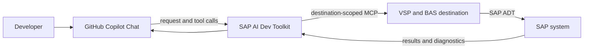

<h1 align="center">🧭 SAP AI Development Toolkit</h1>

<p align="center">
  <strong>Build, test, and deliver ABAP with AI that understands your SAP landscape.</strong><br>
  Bring GitHub Copilot Chat into your development workflow with destination-aware SAP tools.<br>
  Explore real system context, make focused changes, and verify results before delivery.
</p>

<p align="center">
  <a href="https://www.npmjs.com/package/sap-ai-dev-toolkit"></a>
  <a href="https://www.npmjs.com/package/sap-ai-dev-toolkit"></a>
  
  <a href="LICENSE"></a>
</p>

<p align="center">
  
  
  
  
  
</p>

<p align="center">
  <a href="#install"><strong>Get started →</strong></a> ·
  <a href="#copilot-agent">Meet the agents</a> ·
  <a href="#bas">Connect your SAP systems</a> ·
  <a href="#tools">Explore the tools</a>
</p>

## From a prompt to SAP-ready work

SAP AI Dev Toolkit connects GitHub Copilot Chat to the SAP development tools available for each selected destination. Agents can inspect ABAP and CDS, propose changes, run checks, and return the evidence—without losing sight of which SAP system each operation targets.



<p align="center"><strong>Explore → Build → Verify → Prepare for delivery</strong></p>

## ⚡ Quick start

```sh
npm install --global sap-ai-dev-toolkit
sap-ai-dev --setup
```

To also add optional full-stack SAP companion MCP servers for Fiori, UI5, CAP, and browser validation, run:

```sh
sap-ai-dev --setup --tools
```

Then connect a destination in SAP Business Application Studio:

1. Open the Command Palette.
2. Run **MCP: List Servers**.
3. Start the server named after your selected BAS destination.
4. In GitHub Copilot Chat, choose the best-fit bundled agent from the agent picker: **SAP Solution Architect**, **ABAP Developer**, **ABAP Runtime Debugger**, or **RAP Service Developer**.
5. In the Chat tools picker, enable the server for that BAS destination.
6. Ask Copilot to inspect, build, test, or verify something in your SAP landscape.

**Prerequisite:** Node.js 20 or newer. If Go is not already available, the installer can provision the pinned supported Go release automatically.

## 🤖 Available agents and skills

**Agents:** Four user-invocable custom agents are included. Select the best fit from the agent picker in GitHub Copilot Chat, as shown in Quick start.

| | Agent | Best for |
| --- | --- | --- |
| 🧭 | **SAP Solution Architect** | System investigation, SAP standard/API recommendations, Clean Core and side-by-side design, and SDLC orchestration through implementation handoffs and validation gates |
| 🧑‍💻 | **ABAP Developer** | General ABAP, CDS, and RAP implementation, validation, and transport-preparation tasks |
| 🐞 | **ABAP Runtime Debugger** | Runtime incidents, dumps, logs, traces, debugger sessions, call graphs, and performance symptoms |
| 🚀 | **RAP Service Developer** | RAP business objects, behavior implementations, projections, service definitions, service bindings, and OData validation |

**Included skills:** `abap-development` · `abap-testing-quality` · `cds-development` · `rap-development` · `abap-debugging` · `abap-runtime-analysis` · `rap-service-delivery` · `sap-standard-api-analysis` · `clean-core-extensibility` · `sap-sdlc-orchestration` · `sap-transport-release`

If the agents are not listed, install the optional agents and skills under `$HOME/.copilot` when prompted during an interactive global install, then reload BAS if needed. Repository-scoped installation instructions appear below.

## ✨ Your SAP development cockpit, inside Copilot Chat

`sap-ai-dev-toolkit` installs `sap-ai-dev`, discovers your BAS destinations, and exposes a curated SAP development toolset through MCP. Instead of manually switching between chat, terminal commands, repository searches, ADT screens, and SAP checks, describe the outcome you want and let the appropriate bundled agent coordinate the available tools.

<p align="center"><strong>💬 Request → 🔎 Inspect → 🧠 Reason → 🧑‍💻 Implement → 🧪 Verify → 📋 Report</strong></p>

The workflow covers ABAP, CDS, RAP, repository analysis, table and query access, testing, ATC, application logs, transports, and controlled source changes. The live MCP tool list remains the source of truth for what your connected SAP system and active VSP mode expose.

## 🌟 Feature highlights

| | Feature | What it gives you |
| --- | --- | --- |
| 🤖 | **AI-driven ABAP development** | Describe the outcome; a task-fit agent coordinates inspection, implementation, validation, and a clear report. |
| 🧭 | **Destination-aware by design** | Discover BAS destinations and connect each MCP server to one selected SAP system. |
| 🔎 | **Understand before editing** | Trace source, callers, definitions, package contents, dependencies, and CDS impact in one workflow. |
| 🧩 | **CDS + RAP development** | Explore models and dependencies, then build RAP business objects and services with system context. |
| 🗃️ | **Ground decisions in SAP data** | Inspect DDIC structures, read table contents, and run controlled ABAP SQL queries. |
| ✍️ | **Create + edit ABAP objects** | Update supported source, create packages and tables, and run syntax checks before requested activation. |
| ✅ | **Quality built into the flow** | Pair local ABAP linting with SAP syntax checks, ABAP Unit, ATC, editor diagnostics, and formatting. |
| 🐞 | **Debug with system context** | Investigate dumps, traces, application logs, runtime failures, capabilities, and installed components. |
| 🚚 | **Transport-aware workflows** | Check request and lock context before preparing a change; create transports only when authorized. |
| 🧾 | **Reviewable change sets** | Stage multi-object diffs and re-read each source before an explicitly requested apply. |
| 📋 | **Transport readiness evidence** | Bring request, dependency, inactive-object, test, and ATC results together in one report. |
| 🧭 | **ABAP Cloud migration assessment** | Check SAP API release evidence in batches and focus review on recognized unreleased APIs. |
| 🚀 | **Reusable RAP smoke suites** | Turn OData metadata into repeatable GET checks with saved assertions. |
| 🩺 | **Connection Doctor** | Find setup issues across destination reachability, VSP startup, SAP system info, and tool discovery. |
| 🧪 | **Offline playground** | Try the agents and workflows locally with sample SAP data; demo changes disappear on exit. |
| 🔐 | **Controlled SAP state changes** | State-changing actions require a known target and an explicit request; SAP authorizations still apply. |
| 🧱 | **Destination isolation** | Each generated MCP server is tied to its own `SAP_AI_DEV_TOOLKIT_DESTINATION`, helping prevent accidental cross-system execution. |
| 🛡️ | **Credential-safe configuration** | Credentials, cookies, usernames, passwords, and raw destination payloads are not written into MCP configuration. |

The catalog below covers source inspection, data, editing, quality, transports, logs, and multi-step development workflows. Availability can vary by SAP system and VSP mode, so the live `tools/list` response is authoritative.

## 🚀 What can the agent do?

### 🧑‍💻 Build and refactor

- ABAP reports, classes, interfaces, and function groups
- CDS definitions and dependency-aware changes
- RAP business objects and services
- Focused source edits with syntax validation

### 🔍 Understand your SAP codebase

- Search repository objects and packages
- Find definitions and references
- Compare implementations
- Inspect class metadata and dependencies
- Run CDS forward and reverse impact analysis

### 🧪 Validate quality

- ABAP Unit
- ATC checks
- SAP syntax checks
- Local `abaplint`
- BAS editor and LSP diagnostics
- Pretty-print source

### 🏢 Work with the live SAP system

- Read DDIC structures and table content
- Execute ABAP SQL queries
- Inspect system and component information
- Read SLG1 application logs
- Review and create transport requests

## 🧠 Four agents, eleven focused skills

The package ships with four custom agents plus eleven task-focused Copilot Agent Skills:

| | Skill | Best for |
| --- | --- | --- |
| 🧑‍💻 | `abap-development` | Implementing and refactoring ABAP reports, classes, interfaces, and function groups |
| ✅ | `abap-testing-quality` | ABAP Unit, lint, LSP diagnostics, SAP syntax checks, and ATC |
| 🧩 | `cds-development` | CDS modeling, dependency inspection, and consumer impact analysis |
| 🚀 | `rap-development` | RAP business objects and service development |
| 🧭 | `sap-standard-api-analysis` | SAP standard capability, released API, CDS/RAP/OData, and fit-gap analysis before custom development |
| 🧱 | `clean-core-extensibility` | Clean Core, released extensibility, and side-by-side extension design with risk classification |
| 🔁 | `sap-sdlc-orchestration` | Requirement-to-release lifecycle planning, delegated implementation, quality gates, validation, and handover |
| 🐞 | `abap-debugging` | Dumps, logs, traces, and runtime failure diagnosis |
| 🔬 | `abap-runtime-analysis` | Incident triage, traces, debugger state, call graphs, and performance analysis |
| 🚀 | `rap-service-delivery` | RAP service activation, publication, OData validation, and end-to-end runtime checks |
| 🚚 | `sap-transport-release` | Dependency checks and transport preparation; release itself is intentionally unavailable here |

## 🗺️ How it fits together

Each selected BAS destination becomes its own isolated MCP server identity. The MCP client discovers the live tools and schemas, the add-on routes calls to the correct VSP child, and VSP reaches SAP ADT through the selected BAS destination.

## 🧰 Optional full-stack companion MCP servers

ABAP/RAP backend access is provided by this add-on's BAS/VSP proxy. For end-to-end SAP development, setup can also add managed companion MCP entries for frontend, CAP, and browser validation work:

```sh
sap-ai-dev --setup --tools
```

The companion entries are optional and are launched through `npx` only when the MCP client starts them. They are marked as managed by `sap-ai-dev-toolkit`, so rerunning setup can update or remove them without touching unrelated MCP servers.

| MCP entry | Package | Launches | Use when the agent needs to |
| --- | --- | --- | --- |
| `sap-fiori-tools` | `@sap-ux/fiori-mcp-server` | `fiori-mcp` | Generate or adapt Fiori elements/freestyle apps, annotations, and SAP Fiori UX artifacts |
| `ui5-tools` | `@ui5/mcp-server` | `ui5mcp` | Inspect SAPUI5/OpenUI5 projects, manifests, routing, views, controllers, and UI5-specific issues |
| `cap-tools` | `@cap-js/mcp-server` | `cds-mcp` | Inspect CAP CDS models, services, entities, actions, and local CAP application structure |
| `browser-validation` | `@playwright/mcp` | `playwright-mcp` | Open BAS previews, smoke-test Fiori/UI flows, collect screenshots, and verify browser runtime behavior |

Recommended profiles:

- **RAP + Fiori:** select your BAS destination plus `sap-fiori-tools`, `ui5-tools`, and `browser-validation`.
- **CAP on BTP:** select `cap-tools`, `sap-fiori-tools`, `ui5-tools`, and `browser-validation`.
- **UI-only:** select `sap-fiori-tools`, `ui5-tools`, and optionally `browser-validation`.

## 💡 Example requests

Once the destination server is enabled in Copilot Chat, ask for outcomes instead of manually orchestrating individual SAP operations:

> Find every reference to `ZCL_ORDER`, explain the impact of changing method `CREATE_ORDER`, and show me the callers before editing anything.

> Fix the defect in `ZCL_PRICING`, add or update ABAP Unit coverage, run syntax checks and the available tests, and summarize exactly what passed or was skipped.

> Inspect the dependencies and downstream consumers of this CDS view and tell me what would be affected by renaming the field.

> Read company codes from `T001` for this destination and return `BUKRS`, `BUTXT`, `WAERS`, and `LAND1`.

> Check the current object's transport context, prepare the change for transport, but do not release anything.

## 🔐 Enterprise-friendly safety model

| Guardrail | Behavior |
| --- | --- |
| 🎯 **Explicit target** | SAP changes only proceed when the destination and required target details are known. |
| 🚦 **Explicit state change** | Activation, service publication, and transport creation happen only when requested and authorized. |
| 🧪 **Verification first** | The agent uses available lint, syntax, unit-test, ATC, and diagnostics workflows and reports what actually ran. |
| 🔒 **SAP authorization remains authoritative** | The add-on does not bypass backend SAP permissions. |
| 🚚 **Full VSP tool surface** | The proxy exposes every tool registered by the active VSP child, including transport tools; SAP authorizations and VSP safety checks still apply. |
| 🧱 **Per-destination isolation** | Generated MCP entries are scoped to a single `SAP_AI_DEV_TOOLKIT_DESTINATION`. |
| 🔑 **No credentials in `mcp.json`** | Authentication material stays in BAS destination configuration rather than MCP config. |

<a id="install"></a>

## 📦 Installation

Install globally from a BAS dev space:

```sh
npm install --global sap-ai-dev-toolkit
```

If you previously installed the old package, remove it first because the legacy `bas-vsp-mcp` command is no longer shipped:

```sh
npm uninstall --global bas-mcp-addon
npm install --global sap-ai-dev-toolkit
sap-ai-dev --setup
```

The guided setup can also offer companion MCP entries with `sap-ai-dev --setup --tools`:

| Server | npm package | Best for |
| --- | --- | --- |
| SAP Fiori tools | `@sap-ux/fiori-mcp-server` | Fiori elements/freestyle apps, annotations, and UX guidance |
| UI5 tools | `@ui5/mcp-server` | SAPUI5/OpenUI5 project inspection, help, and lint/project support |
| CAP tools | `@cap-js/mcp-server` | CAP CDS/service model inspection and CAP app development |
| Browser validation | `@playwright/mcp` | Fiori/UI smoke tests, screenshots, and browser runtime validation |

The installer handles two setup tasks automatically:

- Looks for Go in `GO_BINARY`, `PATH`, or the package-local Go installation. If none is available, it downloads and installs the pinned supported Go release without prompting.
- Uses the package's checksum-verified patched VSP binary for the current platform. A remote download is the fallback only when the package has no bundled asset.

With `H2O_URL` set, an interactive install opens a checkbox picker with no destinations selected by default. Use **Space** to choose destinations and **Enter** to confirm. Press **a** to toggle all destinations (select all if any are unchecked; otherwise clear the selection). Confirming with none selected removes this add-on's managed MCP entries. When the `cf` CLI 8.18 or newer is authenticated to a targeted space, setup first offers an optional import from that space's Destination service; type **y** then **Enter** to include it, or press **Enter** to skip. Accepted CF and BAS destinations appear together in the picker. npm may run its install hook without an interactive terminal, even when the shell is interactive; in that case, selection is skipped without changing MCP config.

Some current npm versions also require install hooks to be approved. If npm reports that `sap-ai-dev-toolkit`'s `postinstall` was blocked, allow it during a fresh install with `npm install --global --allow-scripts=sap-ai-dev-toolkit sap-ai-dev-toolkit`, or run `sap-ai-dev-toolkit --setup` from an interactive BAS terminal after installation.

The setup report uses icons and terminal colors; set `NO_COLOR=1` to disable ANSI colors. The table is a weather report, not a bouncer: green **PASS** means the ADT probe responded, red **FAIL** means it failed, and yellow **SKIPPED** means it was skipped. Probe failures do not block MCP registration or startup for destinations you select.

Run `sap-ai-dev --setup` later to change the destination selection or remove generated destination entries. Run `sap-ai-dev --setup --tools` to also choose optional companion tools. Use `--npx` to make generated BAS/VSP destination entries start the pinned package through npm instead of relying on a global `sap-ai-dev` command; companion tools already use `npx` with their own npm packages.

If a setup step is skipped or fails, rerun it from an interactive BAS terminal:

```sh
sap-ai-dev --setup
```

To configure without a global install, run the guided setup directly through npm:

```sh
npx --yes --ignore-scripts --package=sap-ai-dev-toolkit sap-ai-dev --setup --npx
```

This lists discovered systems in the same checkbox picker, with nothing selected by default. Use **Space** to choose destinations, **Enter** to confirm, and **a** to toggle all (select all if any are unchecked; otherwise clear the selection). It writes MCP entries that launch the selected servers through npx. The entries pin the package version used during setup, and `--ignore-scripts` avoids running the install-time wizard a second time. After setup, in BAS run **MCP: List Servers**, select each chosen destination, and choose **Start Server**.

For a non-interactive installation or a platform without a published VSP asset, provide a trusted binary override:

```sh
BAS_VSP_BINARY=/path/to/vsp npm install --global sap-ai-dev-toolkit
```

At the end of a global install, the color-coded summary shows the MCP config path, each generated entry name, destination/client/authentication, launch command, and environment key names (not values). The installer does not open an editor automatically; in BAS/VS Code:

1. Open the Command Palette.
2. Run **MCP: List Servers**.
3. Select the generated server name shown in the report and choose **Start Server**.
4. Use **MCP: Open User Configuration** to inspect or edit the generated entries. Each entry is isolated to its destination.

<a id="copilot-agent"></a>

## 🤖 GitHub Copilot ABAP agents and skills

The package includes four user-invocable custom agents (**SAP Solution Architect**, **ABAP Developer**, **ABAP Runtime Debugger**, and **RAP Service Developer**) and eleven task-focused Agent Skills for GitHub Copilot in BAS.

### 🧠 How the SAP Solution Architect and ABAP Developer agents work

1. **Start with architecture when requirements are open-ended.** Use **SAP Solution Architect** to investigate the SAP system, evaluate SAP standard solutions, recommend released APIs, apply Clean Core and side-by-side extensibility, create the solution design, and orchestrate the SDLC through implementation work packages and validation gates.
2. **Understand the request.** Establish the expected behavior and, for SAP changes, the destination, package, and transport or temporary target. Ask only when a material detail is missing.
3. **Inspect before editing.** Read relevant source, tests, callers, dependencies, standard APIs, release state, and conventions; query the active MCP server's live `tools/list` and use its exact destination-prefixed tools and schemas.
4. **Implement with behavior in mind.** Add or refine an ABAP Unit assertion first when an executable regression test is available, then make the smallest change that meets the request.
5. **Verify with available checks.** Use `LintABAP` for caller-supplied source, BAS editor LSP diagnostics when configured, and SAP `SyntaxCheck`, `RunUnitTests`, and `RunATCCheck` when exposed and relevant. Lint and syntax checks do not replace behavior tests.
6. **Protect SAP state.** Only make requested changes. Activate objects or publish services only when asked; create transports only when explicitly authorized. Release and deletion of transports are unavailable through this add-on.
7. **Report observed results.** Summarize architecture decisions, changed objects, implementation handoff or actual validation, activation, and publication outcomes. Identify skipped checks and exact blockers; never claim a check passed if it did not run.

### 🧩 Included Agent Skills

| | Skill | Focus |
| --- | --- | --- |
| 🧑‍💻 | `abap-development` | Implement and refactor ABAP reports, classes, interfaces, and function groups. |
| ✅ | `abap-testing-quality` | ABAP Unit behavior tests, lint, LSP diagnostics, syntax checks, and ATC. |
| 🧩 | `cds-development` | Model CDS definitions and inspect dependencies and consumers. |
| 🚀 | `rap-development` | Build RAP business objects and services; publish only when requested. |
| 🧭 | `sap-standard-api-analysis` | Assess SAP standard capabilities, released APIs, CDS/RAP/OData options, and fit-gap before custom code. |
| 🧱 | `clean-core-extensibility` | Design Clean Core compliant in-app, developer, API/event, and side-by-side extension patterns. |
| 🔁 | `sap-sdlc-orchestration` | Orchestrate discovery, design, implementation handoffs, quality gates, transport readiness, and handover. |
| 🐞 | `abap-debugging` | Diagnose dumps, application logs, traces, and runtime failures. |
| 🔬 | `abap-runtime-analysis` | Analyze incidents, traces, debugger state, call graphs, and performance symptoms. |
| 🚀 | `rap-service-delivery` | Validate RAP service bindings, activation, publication, and end-to-end OData behavior. |
| 🚚 | `sap-transport-release` | Check dependencies and prepare changes for transport; release is not available here. |

### 📥 Install for your BAS user

After destination setup, the installer prints a 🤖 notice that it is waiting for confirmation, then offers to install the bundled agents and all eleven skills under `$HOME/.copilot`. Press **Enter** to install; type **n** then **Enter** to skip. Declining leaves those files unchanged.

These user-level customizations are available across workspaces opened by the same BAS user in the same dev space. Copilot must be available in BAS and may need a window reload to discover new files. A non-interactive install skips the optional prompt; `npm install --ignore-scripts` skips the postinstall wizard entirely.

On reinstall or package upgrade, unchanged add-on-managed files are updated. Existing customizations and files edited since the previous install are preserved; postinstall reports paths that need manual review instead of overwriting them.

### 🗂️ Add the agents and skills to a repository

To commit repository-scoped customizations, copy the packaged files from the BAS workspace root without overwriting existing files:

```sh
ADDON_ROOT="$(npm root -g)/sap-ai-dev-toolkit"
mkdir -p .github/agents .github/skills
cp -n "$ADDON_ROOT/.github/agents/"*.agent.md .github/agents/
cp -Rn "$ADDON_ROOT/.github/skills/." .github/skills/
```

Review skipped or conflicting files and merge changes manually. `LintABAP` analyzes caller-supplied source in memory; it does not read workspace files. `vsp lsp --stdio` supplies editor diagnostics separately and does not appear in `tools/list`.

<a id="bas"></a>

## 🧭 SAP AI Dev Toolkit setup in BAS

`sap-ai-dev --setup` reads BAS destination names from `H2O_URL/api/listDestinations`, then gives each destination's `/sap/bc/adt/discovery` endpoint a quick knock through the BAS proxy. HTTP 2xx, 401, and 403 count as reachable; other responses and network failures are reported but do not exclude discovered destinations from the selection list or prevent startup when selected.

If the `cf` CLI is version 8.18 or newer and authenticated to a targeted space, setup offers an opt-in import from that space's SAP Destination service. It does not create service keys unless you accept. The imported records are limited to the current space and are merged with BAS destinations for selection. OnPremise destinations require choosing a Connectivity service instance; runtime traffic uses that service's proxy, and PrincipalPropagation uses the current CF user's token. Internet destinations use the configured HTTP(S) proxy environment. Setup stores only service-instance/key references in `mcp.json`, not the service-key credentials. At runtime the generated entry verifies the active CF space and resolves those references. Setup removes an add-on-created key only when no remaining CF entry references it and the CLI is targeted to the key's recorded space; keys are left untouched when the space cannot be verified.
Cloud Foundry HTTP destination probes use forward-form HTTP requests, not CONNECT tunnels; SAP Connectivity requires HTTP from the application to its proxy. OnPremise requests are canceled when the client disconnects or the runtime route closes.

Interactive npm install and `sap-ai-dev --setup` both use a checkbox picker with no destinations selected by default. Use **Space** to choose destinations, **Enter** to confirm, and **a** to toggle all (select all if any are unchecked; otherwise clear the selection). Confirming with none checked removes this package's generated MCP entries. Non-interactive installs skip destination selection without changing MCP config. Run the interactive setup command above; add `--npx` when the package is not installed globally.

Setup tidies its own footprint: it reconciles MCP entries managed by this package and removes legacy `sapAiDev_*` / `basVspMcp_*` entries from earlier releases. Existing unrelated MCP servers and top-level configuration such as `inputs` stay untouched.

### 🌐 BAS destination example

First, give BAS a route to your backend: create the destination in **BTP Cockpit → Connectivity → Destinations** in the subaccount where BAS runs.

The sample values sketch an on-premise ABAP backend routed through SAP Cloud Connector; swap in the URL, proxy type, and authentication configured for your landscape.

| Destination field | Example | Notes |
| --- | --- | --- |
| `Name` | `DEMO_ABAP` | Unique BAS destination name. It becomes both `SAP_AI_DEV_TOOLKIT_DESTINATION` and the generated MCP server name. |
| `Type` | `HTTP` | ADT is an HTTP service. |
| `URL` | `https://abap.example.com:44300` | Backend URL exposed through the configured route. |
| `Proxy Type` | `OnPremise` | Use `OnPremise` for Cloud Connector; use `Internet` for a directly reachable public endpoint. |
| `Authentication` | `PrincipalPropagation` | Example only; choose an authentication method configured for the backend and Cloud Connector. |
| `sap-client` | `100` | SAP client to target. The add-on defaults to `001` if omitted. |
| `HTML5.DynamicDestination` | `true` | BAS destination property shown in the supplied sample. |
| `WebIDEEnabled` | `true` | Exposes the destination to BAS development tools. |
| `WebIDEUsage` | `dev_abap,odata_abap` | Include `dev_abap` for ABAP development; add other usages required by your BAS scenario. |
| `CloudConnectorLocationId` | `DEMO-LOCATION` | Optional; set only when the Cloud Connector uses a location ID. |

For on-premise systems, configure Cloud Connector access to the backend host and port first. Keep credentials and authentication material in the BAS destination configuration; never put them in `mcp.json`.

Think of `H2O_URL` as BAS's front door: it must point to the endpoint serving `/api/listDestinations`, not to the SAP backend.

The `/api/listDestinations` response is a JSON array of destination records, like the provided `dests.sample.json`. A representative record:

```json
{
  "Type": "HTTP",
  "HTML5.DynamicDestination": "true",
  "Authentication": "PrincipalPropagation",
  "WebIDEEnabled": "true",
  "ProxyType": "OnPremise",
  "sap-client": "100",
  "Name": "DEMO_ABAP",
  "WebIDEUsage": "dev_abap,odata_abap",
  "Host": "https://abap.example.com:44300",
  "WebIDEExposedHost": "abap.example.com:44300"
}
```

The BAS editor calls the backend address URL; the sample-style list response may report it as `Host`. Discovery needs a non-empty `Name`, reads `Authentication` and `sap-client` case-insensitively, and accepts these fields either at the record root or under `Properties`.

A destination name must start with a letter or digit and contain only letters, digits, `.`, `_`, or `-`.

The add-on probes `http://<Name>.dest/sap/bc/adt/discovery` through the BAS proxy. HTTP 2xx, 401, and 403 mean the ADT endpoint is reachable; other responses and network errors are reported but do not exclude a discovered destination from the selection list.

`WebIDEEnabled`, `WebIDEUsage`, `HTML5.DynamicDestination`, and returned host fields are BAS metadata, not filters used by this probe.

See SAP Help: **Create a Destination to Connect to SAP Business Application Studio** and **Creating a Destination to an ABAP System for BAS**.

### 🔌 Generated MCP server entry

One selected system, one isolated stdio MCP entry. Here's the shape:

```json
{
  "type": "stdio",
  "command": "sap-ai-dev",
  "env": {
    "H2O_URL": "https://bas.example.com",
    "SAP_AI_DEV_TOOLKIT_DESTINATION": "DEMO_ABAP",
    "SAP_ALLOW_TRANSPORTABLE_EDITS": "true"
  },
  "BAS_EXT": "true"
}
```

The MCP protocol `serverInfo.name` matches `BAS_VSP_DESTINATION`, so each wizard-generated destination has its own identity instead of the shared `sap-ai-dev-toolkit` name.

Credentials, cookies, SAP usernames, passwords, and raw BAS destination payloads are not written to the MCP configuration.

### ⚙️ MCP configuration location

The configuration path is selected in this order:

1. `SAP_AI_DEV_MCP_CONFIG`, when set.
2. `BAS_VSP_MCP_CONFIG`, when set for compatibility with earlier releases.
3. An existing MCP user configuration detected automatically.
4. The default MCP user configuration location.

Set `SAP_AI_DEV_MCP_CONFIG` to use a specific configuration file:

```sh
SAP_AI_DEV_MCP_CONFIG="/path/to/mcp.json" sap-ai-dev --setup
```

The file must be strict JSON with an object-valued `servers` property. Existing malformed or incompatible files are rejected without overwriting them.

### 🛠️ Commands

| Need | Command |
| --- | --- |
| See options without starting the MCP server | `sap-ai-dev --help` |
| Walk through setup interactively | `sap-ai-dev --setup` |
| See discovered systems and probe results | `sap-ai-dev --list-destinations` |
| Get the same report in machine-readable, redacted form | `sap-ai-dev --list-destinations --json` |
| Check availability without starting the server | `sap-ai-dev --check` |

With `H2O_URL` set, the normal command starts the MCP proxy. Each generated entry supplies one `SAP_AI_DEV_TOOLKIT_DESTINATION`, so each server stays in its own lane and exposes only its selected SAP system.

The proxy exposes every VSP tool registered by the installed VSP mode, plus local `LintABAP`, destination-scoped workflow tools, and the convenience `GetApplicationLog` mapping when the VSP SAP router is available. It enables transport support and transportable source edits in generated MCP entries. Direct VSP invocation remains unchanged.

Without `H2O_URL`, the command passes arguments directly to the installed VSP binary—no BAS proxy detour.

### 🔄 How an MCP tool call reaches SAP

`sap-ai-dev` is an MCP stdio server and destination router, not a terminal command for individual SAP operations. No shell incantations needed: your MCP client discovers the tools, picks one for the chat request, and sends the call over stdio.

Each generated MCP server entry uses its BAS destination name verbatim: `DEMO_ABAP` stays `DEMO_ABAP`. Tool names use the normalized destination slug instead, so the prefix is `demo-abap` (`demo-abap__GetSource`, `demo-abap__RunQuery`, `demo-abap__LintABAP`). Use the exact names shown by your MCP client; punctuation can change during slugification.

The proxy keeps VSP tool descriptions and input schemas, then adds the destination label. `LintABAP` and the workflow tools are implemented locally; they use the schemas shown by `tools/list` and call only the destination attached to their name. Linting operates on submitted source in memory. The live `tools/list` result remains the source of truth for the installed VSP binary's exact schemas.

<a id="tools"></a>

## 🧰 Tool catalog

From read-only inspection to controlled SAP changes. The catalog is organized by developer intent so you can quickly see what the agent can inspect, query, validate, edit, activate, or prepare for transport.

The menu includes the tools registered by the active VSP mode, the `GetApplicationLog` mapping, local linting, and destination workflows where their required VSP capabilities are available. Focused mode may omit `ActivateMultiple`, `GetUserTransports`, and `GetTransportInfo`; the live `tools/list` result remains authoritative.

### 🧹 Lint submitted ABAP source locally

The per-destination tool name is `<destination-slug>__LintABAP`, for example `demo-abap__LintABAP`. It accepts caller-supplied abapGit-serialized source files; config is optional and, when present, is the full abaplint configuration rather than a merge with defaults.

```json
{
  "files": [
    {
      "filename": "zdemo.prog.abap",
      "source": "REPORT zdemo.\nWRITE 'Hello'."
    }
  ]
}
```

`files` must be a nonempty array of `{ "filename": string, "source": string }` entries. The basename follows `<object>.<type>.<extension>`, such as `zcl_demo.clas.abap`. If the code depends on other objects, include those sources in the same `files` array; the tool does not resolve `config.dependencies`, read local files, make network requests, or contact SAP.

The single text item in the MCP result contains JSON: `{ "status": "clean" | "issues", "filesChecked": number, "issueCount": number, "errors": number, "warnings": number, "infos": number, "issues": [...] }`. Each issue reports filename, rule, severity, message, and start/end positions with line and column. Lint findings—including Error-severity findings—are reports, not MCP tool-call errors.

### 🧩 Review and delivery workflows

These local tools are namespaced by destination. Change-set tools appear when VSP exposes `GetSource` and `WriteSource`; transport and Clean Core tools appear when their underlying checks exist. RAP suite tools use the selected destination's proxy route.

| Tool | Behavior |
| --- | --- |
| `PrepareABAPChangeSet` | Stage up to 12 full-source `WriteSource` changes and return line diffs plus SHA-256 fingerprints. Proposals stay in MCP process memory. |
| `ApplyABAPChangeSet` | Re-read each object and write only when its source still matches the reviewed version. It stops on conflicts or errors and reports partial application; it does not roll back SAP writes. |
| `CheckTransportReadiness` | Run a caller-selected bundle of transport, dependency, inactive-object, ABAP Unit, and ATC checks. Completed calls may still contain findings. |
| `PlanABAPCloudMigration` | Batch `GetAPIReleaseState` checks for ADT object URIs and prioritize recognized unreleased APIs ahead of unknown and released states. SAP evidence stays attached. |
| `GenerateRAPRegressionSuite` | Read `$metadata` and return reusable JSON with a metadata check and one `$top=1` GET for each entity set. |
| `RunRAPRegressionSuite` | Run the saved suite with GET requests, expected status/content-type checks, and optional JSON-path assertions. Requests stay under the same `/sap/opu/odata` service root; response bodies are capped at 2 MiB. |

For a change set, pass the exact `GetSource` arguments and observed full source for each object, plus exact `WriteSource` arguments containing the replacement source. Each source is limited to 128 KiB and 1,000 lines so the full diff can be reviewed. Review every diff before calling `ApplyABAPChangeSet`. Each object is checked immediately before its write; a change after that read can still race the write because VSP does not expose compare-and-write here.

For a transport report, include exactly one `GetTransport` check whose `transport` matches `transport_id`, then add applicable dependency, inactive-object, ABAP Unit, or ATC checks. Each uses the exact arguments in the live upstream schema.

For an ABAP Cloud assessment, get object URIs from `SearchObject` and pass them to `PlanABAPCloudMigration`. It reports release evidence; it does not guess replacement APIs. Save the JSON from `GenerateRAPRegressionSuite` and pass it to `RunRAPRegressionSuite` after relevant service changes.

`sap-ai-dev-toolkit --doctor` probes each discovered destination, starts VSP, calls `GetSystemInfo` when available, and lists MCP tools. `--doctor --json` prints redacted results and exits unsuccessfully when a required check fails.

`sap-ai-dev-toolkit --demo` starts an isolated server with sample ABAP objects, test and ATC results, a sample transport, and synthetic OData metadata and rows. Source edits and transport creation stay in process memory and disappear on exit. The demo does not discover or contact BAS or SAP destinations.

### 🔎 Find and understand ABAP objects

| Tool | What it does |
| --- | --- |
| `GetSource` | Read source for programs, classes, interfaces, function modules and groups, includes, CDS, and supported RAP/DDIC objects. |
| `SearchObject` | Find repository objects by name or wildcard query. |
| `GrepObjects` | Search regular expressions across specified object URLs. |
| `GrepPackages` | Search regular expressions in one or more packages, optionally including subpackages. |
| `FindDefinition` | Locate a symbol's definition from source text and a position. |
| `FindReferences` | Find references to an object or a symbol. |
| `GetContext` | Summarize public signatures of source dependencies for code review. |
| `CompareSource` | Compare two objects and return a unified diff. |
| `GetClassInfo` | Inspect class methods, attributes, interfaces, and inheritance metadata. |
| `GetPackage` | Read package details. |
| `GetAPIReleaseState` | Check whether an object is released for S/4HANA Clean Core / ABAP Cloud development; use the URI returned by `SearchObject`. |
| `GetFunctionGroup` | Read function-group source. |
| `GetMessages` | Read the messages defined by an ABAP message class (SE91). |
| `GetInactiveObjects` | List objects changed by the current user but not yet activated. |

### 🗃️ Read SAP tables and metadata

| Tool | What it does |
| --- | --- |
| `GetTable` | Read an ABAP Dictionary table's structure. |
| `GetTableContents` | Read table rows, optionally with an ABAP SQL filter and row limit. |
| `RunQuery` | Run a freestyle ABAP SQL query against the SAP database. |
| `GetCDSDependencies` | Follow a CDS view's forward dependencies to its sources. |
| `GetCDSImpactAnalysis` | Find downstream consumers of a CDS view (reverse dependencies). |
| `GetCDSElementInfo` | Read CDS element names, types, annotations, and semantic metadata. |

`RunQuery` uses ABAP SQL, not generic SQL. Use `max_rows` instead of `LIMIT`; for ordering use `ASCENDING` or `DESCENDING`, not `ASC` or `DESC`.

SAP authorizations and the destination's available APIs still apply.

### ✍️ Create, update, and activate

| Tool | What it does |
| --- | --- |
| `WriteSource` | Create or update supported ABAP source objects; detects create versus update in upsert mode. |
| `EditSource` | Replace a specific source fragment; syntax checking is enabled by default. |
| `CreatePackage` | Create a package; transportable packages need a transport and software component. |
| `CreateTable` | Create a transparent DDIC table from a JSON field definition. |
| `SyntaxCheck` | Ask SAP to syntax-check source before saving or activation. |
| `Activate` | Activate one named ABAP object. |
| `ActivatePackage` | Activate inactive objects in dependency order. If package is omitted, it can activate all inactive objects for the current user. |
| `ActivateMultiple` | Activate related objects together while resolving mutual dependencies, such as an include and its main program. |

The write, create, and activation tools change SAP state. Confirm the target, package, and transport before using them. `EditSource` performs a focused replacement; its default syntax check prevents saving when syntax errors are reported.

### ✅ Test and inspect the system

| Tool | What it does |
| --- | --- |
| `RunUnitTests` | Run ABAP Unit tests for an object; dangerous and long-running tests are excluded by default. |
| `RunATCCheck` | Run an ABAP Test Cockpit check and return findings. |
| `GetSystemInfo` | Read system ID, SAP release, kernel, and database details. |
| `GetInstalledComponents` | List installed software components and versions. |
| `GetFeatures` | Probe optional system capabilities, including abapGit, RAP/OData, AMDP debugging, UI5/BSP, and CTS transports. |
| `PrettyPrint` | Format ABAP source text without saving it to SAP. |

### 🚚 Inspect and create transports

| Tool | What it does |
| --- | --- |
| `ListTransports` | List a user's transport requests with optional status, type, source, date, and grouping filters. |
| `GetUserTransports` | Read and group a user's transport requests and tasks; supports organizer filters and source selection. |
| `GetTransport` | Read a transport request's details, objects, and tasks. |
| `GetTransportInfo` | Find eligible transports and lock status for an ABAP object or package. |
| `CreateTransport` | Create a transport request. |
| `ReleaseTransport` | Release a transport request when registered by VSP and authorized in SAP. |
| `DeleteTransport` | Delete a transport request when registered by VSP and authorized in SAP. |

The proxy starts VSP with `--enable-transports` and omits `--transport-read-only`. Generated MCP entries set `SAP_ALLOW_TRANSPORTABLE_EDITS=true` so source edits in transportable packages are permitted. VSP safety checks and SAP authorizations still apply.

### 📜 Read SAP application logs (SLG1)

| Tool | What it does |
| --- | --- |
| `GetApplicationLog` | Extract newest-first application log entries, optionally including message details and texts. |

- Filter by program, user, object, subobject, from, and to.
- `max_results` defaults to 100. Date-only `to` values include the full day.
- `messages: true` adds BALDAT details and T100 message text; otherwise, the tool returns log headers only.
- The proxy maps this convenience tool to the single `SAP(action="analyze", type="application_log")` operation. The general-purpose `SAP` router is also exposed when VSP registers it.

The proxy exposes all tools registered by the child VSP process. The object deletion, debugger, trace, general-purpose SAP router, and transport tools are callable when VSP registers them. Direct VSP invocation without `H2O_URL` retains the VSP binary's own tool surface.

### 🚀 Ready to put the tools to work from chat?

1. Start the generated server in BAS with **MCP: List Servers**.
2. In the Chat tools picker, enable the server for the destination you want.
3. Ask for the operation in plain language. The MCP client sends `tools/call`; no need to type a tool such as `GetSource` into a terminal.
4. Check the response in chat. For source edits, ask for a syntax check and tests before activation when that matches your workflow.

For a quick table read—say, company codes from `T001`—select the destination's `RunQuery` tool (for `DEMO_ABAP`, `demo-abap__RunQuery`) and pass:

```json
{
  "sql_query": "SELECT BUKRS, BUTXT, WAERS, LAND1 FROM T001",
  "max_rows": 100
}
```

The same request can be expressed to an MCP client as:

```json
{
  "jsonrpc": "2.0",
  "id": 2,
  "method": "tools/call",
  "params": {
    "name": "demo-abap__RunQuery",
    "arguments": {
      "sql_query": "SELECT BUKRS, BUTXT, WAERS, LAND1 FROM T001",
      "max_rows": 100
    }
  }
}
```

Use the name returned by `tools/list` instead of copying the example name. For a plain table read, `GetTableContents` requires `table_name` and accepts `max_rows`; `RunQuery` requires `sql_query` and accepts `max_rows` or `all_rows`.

To read a class implementation, select `GetSource` and pass:

```json
{
  "object_type": "CLAS",
  "name": "ZCL_ORDER",
  "include": "implementations"
}
```

The MCP client discovers the schemas; callers do not need to memorize every argument. For example, `GetSource` requires `object_type` and `name`, while `GrepPackages` requires `packages` and `pattern`. Inspect the live schema before calling an unfamiliar tool.

### 🔍 Inspect installed servers and tools

| What to inspect | How |
| --- | --- |
| Add-on command options | `sap-ai-dev --help` |
| BAS destinations and probe status | `sap-ai-dev --list-destinations --json` |
| Destination availability only | `sap-ai-dev --check` |
| Generated server names and destination mapping | **MCP: Open User Configuration**; look for entries named after the BAS destination and `BAS_VSP_DESTINATION`. |
| Running server | **MCP: List Servers**; select the server and choose **Start Server**. |
| Tools and exact schemas | Expand that server in the Chat tools picker. At the protocol level, MCP clients request `tools/list`, whose entries include `name`, `description`, and `inputSchema`. |
| Runtime and tool-call logs | Select the MCP server in the Output view. Startup, call lifecycle, and child stderr logs are written to stderr; child MCP log notifications are forwarded to the client. Tool arguments and result contents are not logged. |
| Installed package version | `npm list --global sap-ai-dev-toolkit` |

After MCP initialization, a raw inspection request has this shape (normally sent by the client, not typed into the terminal):

```json
{"jsonrpc":"2.0","id":1,"method":"tools/list","params":{}}
```

The response contains a `tools` array. A `RunQuery` entry resembles this excerpt; the actual description may include more detail:

```json
{
  "name": "demo-abap__RunQuery",
  "description": "Execute an ABAP SQL query [destination: DEMO_ABAP]",
  "inputSchema": {
    "type": "object",
    "properties": {
      "sql_query": { "type": "string" },
      "max_rows": { "type": "number" },
      "all_rows": { "type": "boolean" }
    },
    "required": ["sql_query"]
  }
}
```

`--list-destinations` reports discovery and probe status; it does not list the MCP tools. Use the MCP client tool picker or its `tools/list` inspection for that. stdout is reserved for MCP protocol messages while the server is running, so do not pipe the normal server command to a shell JSON formatter.

### 🔧 Environment variables

| Variable | Purpose |
| --- | --- |
| `H2O_URL` | BAS endpoint used to discover destinations. Required for BAS discovery. |
| `SAP_AI_DEV_TOOLKIT_DESTINATION` | Comma-separated destination allowlist for normal runtime discovery. Setup clears this temporarily so it can display all eligible systems. |
| `SAP_AI_DEV_TOOLKIT_MODE` | VSP child mode (`expert` by default; `focused` omits `ActivateMultiple`, `GetUserTransports`, and `GetTransportInfo`). The proxy exposes its curated tools plus tools listed in `tools.md` when registered by that mode, including local `LintABAP`. |
| `SAP_ALLOW_TRANSPORTABLE_EDITS` | Generated MCP entries set this to `true` to permit source edits in transportable packages; VSP safety checks and SAP authorizations still apply. |
| `SAP_AI_DEV_MCP_CONFIG` | Explicit MCP user configuration path. |
| `BAS_VSP_MCP_CONFIG` | Backward-compatible alias for the MCP user configuration path. |
| `BAS_VSP_BINARY` | Trusted prebuilt VSP executable; skips Go and binary provisioning. |
| `BAS_VSP_BINARY_URL` | Alternate VSP binary download URL. |
| `BAS_VSP_CACHE_DIR` | Binary cache directory. |
| `GO_BINARY` | Explicit Go executable used for provisioning when automatic Go installation is unavailable. |
| `SAP_AI_DEV_TOOLKIT_SKIP_PROBE=true` | Skip destination probes; useful for controlled diagnostics or fixtures. |
| `HTTP_PROXY` / `HTTPS_PROXY` | BAS proxy settings used for destination-list requests, destination probing, and child processes. |
| `NO_PROXY` | Proxy bypass list for BAS destination-list requests; `.dest` hosts remain routed through the BAS proxy. |

Existing installs that still set the previous `BAS_VSP_*` environment variables remain supported. The setup wizard writes new MCP entries with the `SAP_AI_DEV_TOOLKIT_*` names.

<a id="troubleshooting"></a>

## 🩺 Troubleshooting

No systems on the list? Start at BAS's front door and check the destination names:

```sh
curl "$H2O_URL/api/listDestinations"
sap-ai-dev --list-destinations --json
```

Next, check that the backend answers at `/sap/bc/adt`.

Runtime diagnostics take the stderr lane. In the MCP server's Output view, check per-destination ADT probe status, VSP child stderr, and failed tool-call details; stdout is reserved for MCP protocol messages.

If automatic Go or VSP provisioning fails, check network access and the package's supported platform. You can install Go manually or set `GO_BINARY` as an explicit fallback. A trusted prebuilt VSP can be supplied with `SAP_AI_DEV_TOOLKIT_BINARY`.

## 🧑‍💻 Development

Run the built-in Node.js test suite:

```sh
npm test
```

The package repository is [grknylmz/sap-ai-dev-toolkit](https://github.com/grknylmz/sap-ai-dev-toolkit).

## 🚀 Publishing to npm

The package publisher reads `NPM_PUBLISH_TOKEN` from the root `.env` file (already gitignored) or from the environment. Create `.env` with a publish-capable npm token:

```sh
NPM_PUBLISH_TOKEN=npm_...
```

- `npm run publish:npm` publishes the version already set in `package.json`.
- To publish a patch bump, run `npm run publish:npm -- --patch`; it updates `package.json` and `package-lock.json` before publishing. If publishing fails after the bump, retry without `--patch`.
- Preview the package without publishing or changing its version with `npm run publish:npm -- --dry-run`.

The token is not printed or stored in the repository.

## 📄 Acknowledgements and licenses

The original SAP AI Development Toolkit code and project changes are copyright (c) 2026 Gurkan Yilmaz and released under the MIT License. Everyone may use, copy, modify, distribute, sublicense, and sell copies, provided the copyright and license notices are retained; the software is provided without warranty. See `LICENSE`. Bundled VSP and third-party components retain their own licenses and notices in `NOTICE` and `LICENSE-APACHE-2.0.txt`.

This add-on bundles patched binaries from Vibing Steampunk (VSP), created by Alice Vinogradova and contributors. The binaries are built from upstream commit `9886d27`; this repository's BAS proxy-auth patch is in `patches/vsp-bas-proxy-auth.patch`.

Thanks to the VSP maintainers for the ADT/MCP implementation.

VSP is MIT-licensed. It permits use, modification, redistribution, and sale, provided the copyright and license notice are retained. It is permissive, not copyleft, and disclaims warranty.

The upstream VSP NOTICE identifies `open-rfc-go` and `open-rfc` under Apache-2.0. Redistributors must include the license and preserve applicable notices. Apache-2.0's patent license terminates if a recipient initiates patent litigation alleging that the work infringes; it grants no general trademark rights.

This package includes the upstream VSP license and notices, plus the Apache-2.0 license text, in `LICENSE`, `NOTICE`, and `LICENSE-APACHE-2.0.txt`. The upstream notice records other Go-module licenses in VSP's `go.mod` and `go.sum`; this is not a full audit of every transitive dependency.

License sources:

- VSP `LICENSE`
- VSP `NOTICE`
- Apache License 2.0
